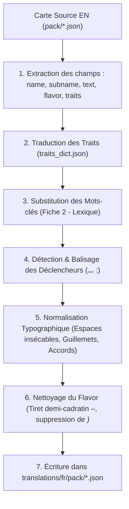

# Procédure Normative de Traduction Automatique d'un Pack
## Marvel Champions LCG — Pipeline de Données MC4DB (`marvelsdb_fanmade_data`)

Ce guide définit la **méthodologie officielle et exhaustive** pour traduire un pack (officiel ou fanmade) de l'anglais vers le français dans l'écosystème **MC4DB**.
Traduire un pack ne se limite pas à traduire le texte de ses cartes : l'opération exige une synchronisation coordonnée sur **4 fichiers distincts** de la base de données.

---

## 1. Vue d'Ensemble & Les 4 Fichiers Cibles

Toute traduction complète d'un pack impacte l'arborescence suivante :

```
marvelsdb_fanmade_data/
├── translations/fr/
│   ├── packs.json                      ← [1] Nom français du pack (index global)
│   ├── sets.json                       ← [2] Noms français de tous les sets du pack
│   └── pack/
│       ├── [pack_code].json            ← [3] Cartes Joueur / Héros traduites
│       └── [pack_code]_encounter.json  ← [4] Cartes Rencontre / Némésis traduites (si applicable)
```

| Fichier | Rôle dans MC4DB | Champs requis | Exemple |
|---|---|---|---|
| **1. `translations/fr/packs.json`** | Nom d'affichage du pack dans le sélecteur et les filtres. | `code`, `name` | `{"code": "alpha_flight_by_designhacker", "name": "Alpha Flight"}` |
| **2. `translations/fr/sets.json`** | Noms des ensembles de cartes (héros, némésis, modulaires, scénarios). | `code`, `name` | `{"code": "sasquatch_by_designhacker_nemesis", "name": "Némésis de Sasquatch"}` |
| **3. `translations/fr/pack/[pack].json`** | Cartes joueur de l'extension (héros, alter ego, alliés, événements, etc.). | `code`, `name`, `text`, `flavor`, `traits`, `subname` | Voir section 4 |
| **4. `translations/fr/pack/[pack]_encounter.json`** | Cartes du deck de rencontre (obligations, sbires némésis, manigances annexes). | `code`, `name`, `text`, `flavor`, `traits` | Voir section 4 |

---

## 2. Règles de Traduction du Nom de Pack (`packs.json`)

Le fichier `translations/fr/packs.json` centralise la traduction de tous les packs (officiels issus de `packs.json` et fanmade issus de `packs_fanmade.json`).

### 2.1 Typologie des Packs & Principes de Traduction

L'analyse de l'existant révèle les règles de traduction selon le type de pack (`pack_type_code`) :

| Type de Pack | Règle de Traduction FR | Règle de Casse FR | Exemples observés dans le corpus |
|---|---|---|---|
| **Pack Héros** (`hero`, `hero_fanmade`) | Si le personnage possède un nom officiel en français chez Panini/Marvel France, on l'adopte obligatoirement. S'il conserve son nom anglais en VF, on le garde tel quel. | Majuscules aux noms propres uniquement. | `The Green Goblin` $\rightarrow$ **Le Bouffon vert**<br>`Ms. Marvel` $\rightarrow$ **Miss Marvel**<br>`Wasp` $\rightarrow$ **La Guêpe**<br>`Quicksilver` $\rightarrow$ **Vif-Argent**<br>`Scarlet Witch` $\rightarrow$ **La Sorcière Rouge**<br>`Ant-Man` $\rightarrow$ **Ant-Man** *(inchangé)*<br>`Alpha Flight` $\rightarrow$ **Alpha Flight** *(inchangé)* |
| **Pack Scénario** (`scenario`, `scenar_fanmade`) | Traduction du titre de scénario ou du nom du super-vilain. | Majuscule au premier mot et aux noms propres (Title Case français modéré). | `The Wrecking Crew` $\rightarrow$ **Les Démolisseurs**<br>`The Once and Future Kang` $\rightarrow$ **Kang le Conquérant**<br>`Madripoor's Dragon` $\rightarrow$ **Le Dragon de Madripoor** |
| **Extension de Campagne** (`expansion`, `campaign`, `fm_story`) | Traduction du titre narratif officiel français (ou traduction littéraire fidèle). | Casse française standard (pas de majuscule à chaque mot comme en anglais). | `Core Set` $\rightarrow$ **Boîte de base**<br>`The Rise of Red Skull` $\rightarrow$ **L'Avènement de Crâne Rouge**<br>`Galaxy's Most Wanted` $\rightarrow$ **Convoitise Galactique**<br>`The Mad Titan's Shadow` $\rightarrow$ **L'Ombre du Titan Fou**<br>`Sinister Motives` $\rightarrow$ **Mobiles Sinistres**<br>`Mutant Genesis` $\rightarrow$ **Genèse Mutante**<br>`Age of Apocalypse` $\rightarrow$ **L'Âge d'Apocalypse** |

### 2.2 Format JSON Strict
L'entrée dans `translations/fr/packs.json` ne contient **que deux champs** :
```json
{
    "code": "alpha_flight_by_designhacker",
    "name": "Alpha Flight"
}
```

---

## 3. Règles de Traduction des Noms de Sets (`sets.json`)

Les cartes de Marvel Champions sont regroupées en ensembles identifiés par `set_code`. Le fichier `translations/fr/sets.json` contient les traductions de ces libellés.

### 3.1 Règle Absolue pour les Ensembles Némésis (`card_set_type_code: "nemesis"`)
- **Format canonique obligatoire** :
  - Devant consonne : **`Némésis de [Nom FR du Héros]`**
  - Devant voyelle ou H muet : **`Némésis d'[Nom FR du Héros]`**
- 🔴 **INTERDIT** : Ne jamais écrire *« [Héros] Némésis »*, *« Nemesis de [Héros] »* (sans accent), ou *« Nemesis Set »*.
- **Exemples vérifiés dans le corpus** :
  - `iron_man_nemesis` $\rightarrow$ `Némésis d'Iron Man`
  - `she_hulk_nemesis` $\rightarrow$ `Némésis de Miss Hulk`
  - `spider_man_nemesis` $\rightarrow$ `Némésis de Spider-Man`
  - `guardian_by_designhacker_nemesis` $\rightarrow$ `Némésis de Guardian`
  - `sasquatch_by_designhacker_nemesis` $\rightarrow$ `Némésis de Sasquatch`
  - `snowbird_by_designhacker_nemesis` $\rightarrow$ `Némésis de Snowbird`
  - `shaman_by_designhacker_nemesis` $\rightarrow$ `Némésis de Shaman`

### 3.2 Ensembles de Héros (`card_set_type_code: "hero"`)
- Prend simplement le **nom français du héros** correspondant au titre de son identité :
  - `she_hulk` $\rightarrow$ `Miss Hulk`
  - `wsp` $\rightarrow$ `La Guêpe`
  - `guardian_by_designhacker` $\rightarrow$ `Guardian`
  - `sasquatch_by_designhacker` $\rightarrow$ `Sasquatch`
  - `puck_by_designhacker` $\rightarrow$ `Puck`

### 3.3 Ensembles de Rencontre & Modulaires (`card_set_type_code: "modular" / "villain"`)
- Traduction soignée respectant les conventions graphiques de Marvel Champions :
  - `bomb_scare` $\rightarrow$ `Alerte à la Bombe`
  - `masters_of_evil` $\rightarrow$ `Maîtres du Mal`
  - `under_attack` $\rightarrow$ `Civils Attaqués`
  - `legions_of_hydra` $\rightarrow$ `Légions d'Hydra`
  - `the_doomsday_chair` $\rightarrow$ `Le Siège de l'Apocalypse`
  - `goblin_gimmicks` $\rightarrow$ `Gadgets Gobelins`

---

## 4. Pipeline Automatisé de Traduction des Cartes

Le fichier de cartes traduit (`translations/fr/pack/[pack].json`) ne reproduit **jamais** les données numériques de structure (`cost`, `attack`, `defense`, `health`, etc.) qui sont héritées de la version anglaise (`pack/[pack].json`).
Il ne porte **strictement que les champs translatables** :

```json
{
    "code": "504518a",
    "name": "Sasquatch",
    "text": "<i>Stratégie</i> — <b>Réponse forcée</b> : après le début de la phase des joueurs, choisissez...",
    "traits": "Alpha Flight. Gamma."
}
```

### Les 7 Étapes de Transformation d'une Carte :



#### Étape 1 : Filtrage des champs
Extraire uniquement `code` (clé d'appariement obligatoire), `name`, `subname` (si présent), `text` (si présent), `flavor` (si présent) et `traits` (si présent).

#### Étape 2 : Traduction des Traits
- Découper les traits sur le séparateur point-espace (`. `).
- Préserver les acronymes atomiques : `[[S.H.I.E.L.D.]]` et `[[S.W.O.R.D.]]`.
- Consulter le dictionnaire canonique `traits_dict.json` :
  - Traits communs $\rightarrow$ traduit avec majuscule initiale (`Attack` $\rightarrow$ `Attaque`, `Skill` $\rightarrow$ `Compétence`, `Location` $\rightarrow$ `Lieu`).
  - Mots composés $\rightarrow$ majuscule uniquement sur le premier terme (`Superpower` $\rightarrow$ `Super-pouvoir`).
  - Équipes et franchises $\rightarrow$ conservés sans traduction (`Avenger`, `Alpha Flight`, `X-Men`, `Wakanda`).
- Rejoindre avec `. ` et terminer obligatoirement par un point : `"Alpha Flight. Gamma."`.

#### Étape 3 : Remplacement des Mots-clés Canoniques
S'appuyer sur la **Fiche 2 (Lexique)** pour éviter tout faux ami :
- `Surge` $\rightarrow$ `Renfort`
- `Overkill` $\rightarrow$ `Déferlement`
- `Piercing` $\rightarrow$ `Perçant`
- `Toughness` $\rightarrow$ `Ténacité`
- `Retaliate X` $\rightarrow$ `Riposte X`
- `Guard` $\rightarrow$ `Garde`
- `Patrol` $\rightarrow$ `Patrouille`
- `Quickstrike` $\rightarrow$ `Coup rapide`
- `Steady` $\rightarrow$ `Solide`
- `Stalwart` $\rightarrow$ `Robuste`
- `Hinder X` $\rightarrow$ `Entrave X`
- `Uses` $\rightarrow$ `Utilisations`

#### Étape 4 : Détection & Balisage des Déclencheurs
- Mettre en gras uniquement les déclencheurs de la liste blanche :
  - `<b>Action de héros</b> : `, `<b>Action d'alter ego</b> : `, `<b>Action</b> : `
  - `<b>Interruption de héros</b> (<i>défense</i>) : `, `<b>Interruption forcée</b> : `
  - `<b>Réponse forcée</b> : `, `<b>Réponse de héros</b> : `, `<b>Réponse</b> : `
  - `<b>Ressource de héros</b> : `, `<b>Ressource d'alter ego</b> : `, `<b>Ressource</b> : `
- Mettre en italique le nom thématique de capacité s'il précède un tiret cadratin :
  - `<i>Stratégie</i> — <b>Réponse forcée</b> : `
- Sortir impérativement le deux-points de la balise fermante `</b> : `.


#### Étape 5 : Normalisation Typographique Française (Fiche 1)
- **Espaces insécables (`\u00A0`)** : devant `:`, `!`, `?`, et de part et d'autre de `—`.
- **Casse après `:`** : forcer la minuscule (ex: `<b>Action</b> : redressez...`) sauf si le mot suivant est un nom propre identifié.
- **Guillemets** : remplacer systématiquement `"..."` par `« ... »`.
- **Flèche d'effet** : remplacer `->` par ` → `.
- **Accords en genre** :
  - Sbire / Attachement $\rightarrow$ `Une fois révélé :`
  - Traîtrise / Manigance / Obligation $\rightarrow$ `Une fois révélée :`

#### Étape 6 : Nettoyage du Flavor (Texte d'ambiance)
- Supprimer toutes les balises `<i>` et `</i>` dans le flavor (le site gère l'italique en CSS).
- Utiliser le tiret demi-cadratin `–` pour l'auteur de citation : `« Citation » – Auteur`.

---

## 5. Protocole de Contrôle Qualité & Validation

Avant de valider ou commiter la traduction d'un pack, exécuter le script de validation :

```powershell
node C:\OS-Merlin\projets\marvelsdb_fanmade_data\scratch\validate_packs_deep.cjs
```

### Critères d'Acceptation (100 % requis) :
- ✅ **0 anomalie de ponctuation** (aucun deux-points sans espace insécable).
- ✅ **0 guillemet droit** dans les textes français.
- ✅ **0 faux ami** terminologique.
- ✅ **0 balise `<b>` non homologuée**.
- ✅ **0 tiret cadratin dans le flavor**.
- ✅ **0 token obsolète `[player]`**.
- ✅ **Test de non-régression validé** : `node rules_card_terms.verif.cjs` (21 ok, 0 KO).

---

## 6. Étude de Cas Complète : Le Pack Alpha Flight

Pour le pack `alpha_flight_by_designhacker`, la procédure a produit :

1. **Nom du Pack dans `translations/fr/packs.json`** :
   ```json
   {
       "code": "alpha_flight_by_designhacker",
       "name": "Alpha Flight"
   }
   ```
2. **Noms des Sets dans `translations/fr/sets.json`** :
   - `guardian_by_designhacker` $\rightarrow$ `Guardian`
   - `guardian_by_designhacker_nemesis` $\rightarrow$ `Némésis de Guardian`
   - `sasquatch_by_designhacker` $\rightarrow$ `Sasquatch`
   - `sasquatch_by_designhacker_nemesis` $\rightarrow$ `Némésis de Sasquatch`
   - `puck_by_designhacker` $\rightarrow$ `Puck`
   - `puck_by_designhacker_nemesis` $\rightarrow$ `Némésis de Puck`
   - `snowbird_by_designhacker` $\rightarrow$ `Snowbird`
   - `snowbird_by_designhacker_nemesis` $\rightarrow$ `Némésis de Snowbird`
   - `shaman_by_designhacker` $\rightarrow$ `Shaman`
   - `shaman_by_designhacker_nemesis` $\rightarrow$ `Némésis de Shaman`
   - `alpha_flight_by_designhacker` $\rightarrow$ `Alpha Flight`
   - `vindicator_by_designhacker_nemesis` $\rightarrow$ `Némésis de Vindicator`
3. **Cartes Joueur (`translations/fr/pack/alpha_flight_by_designhacker.json`)** :
   - **75 cartes** traduites avec 100 % de conformité.
4. **Cartes Rencontre (`translations/fr/pack/alpha_flight_by_designhacker_encounter.json`)** :
   - **36 cartes** traduites avec 100 % de conformité.
